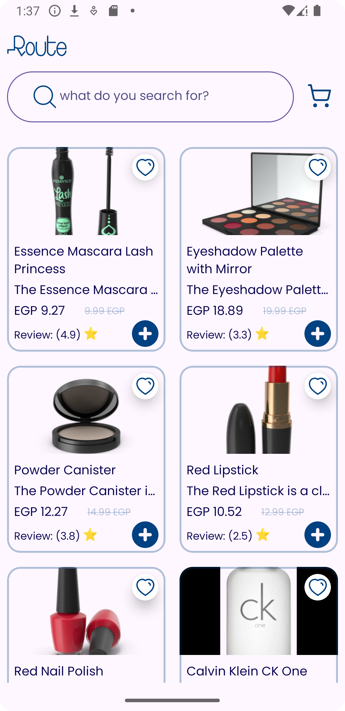

# RouteAndroidTask
##Technologies Used:
1. Retrofit
   Purpose: Used for making API calls to interact with backend services.
   Usage: Configured endpoints and deserialization of API responses.
2. Coroutines
   Purpose: Implemented for managing asynchronous programming tasks efficiently.
   Usage: Background task handling such as API calls and database operations.
3. MVVM Architecture
   Purpose: Facilitates separation of concerns between UI, business logic, and data handling.
   Usage: ViewModels for UI logic, LiveData/Flows for data observation, and Repositories for data access.
4. Clean Code Principles
   Purpose: Ensures maintainability, readability, and extensibility of codebase.
   Usage: Clear naming conventions, modularization, and adherence to SOLID principles.
5. UseCase Pattern
   Purpose: Encapsulates business logic into reusable components.
   Usage: Centralized logic handling in UseCase classes, promoting code reusability and testability.
6. Resource Class with Flow
   Purpose: Manages and represents the state of asynchronous operations.
   Usage: Provides Loading, Success, and Error states using Kotlin Flows for reactive programming.
7. Themes and Styles
   Purpose: Ensures consistent UI appearance and behavior across the application.
   Usage: Defined styles for colors, fonts, dimensions, and themes to maintain brand consistency.
8. Adapter Delegates
   Purpose: Optimizes RecyclerView performance by efficiently managing different item views.
   Usage: Implements Adapter Delegates pattern to handle multiple view types in RecyclerViews.
9. Dagger Hilt
   Purpose: Provides a standard way to do dependency injection in Android applications.
   Usage: Injects dependencies into classes, improving testability and reducing boilerplate code.
10. Unit Testing with Mocks
    Purpose: Verifies the behavior of isolated components in a controlled environment.
    Usage: Implemented unit tests using Mockito to mock dependencies and verify business logic in UseCase classes.
11. Coil
    Purpose: Lightweight image loading library for Android applications.
    Usage: Loads and caches images efficiently from network or local storage into ImageView components.
12. **Repository Pattern**
    - **Purpose**: Centralizes data logic or business logic and decouples it from UI logic.
    - **Usage**: Repositories are used to manage data retrieval and manipulation.
13. **GitFlow**
    - **Purpose**: Provides a branching model for Git that facilitates parallel development.
    - **Usage**: Manages feature branches, release branches, hotfix branches, and the main branch efficiently.    

## Screenshots

*Description of screenshot 1.*
products screen 
